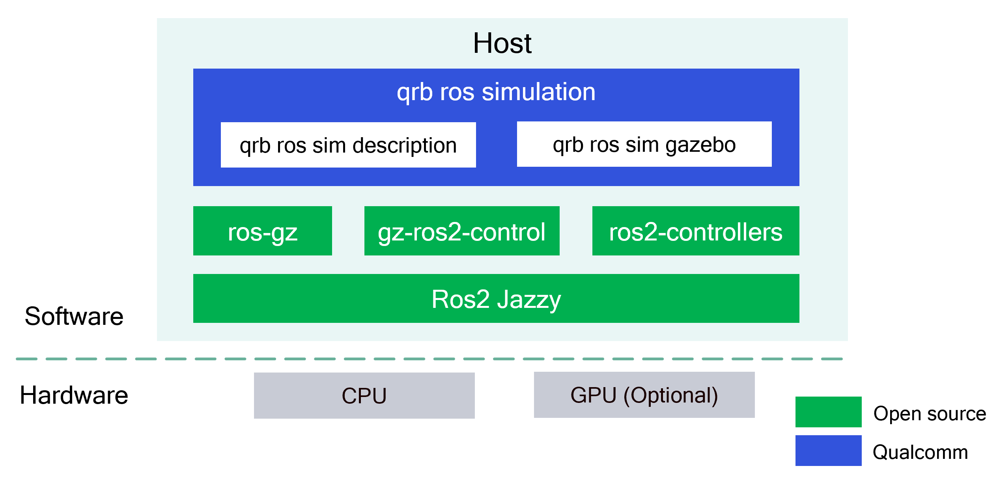

<div align="center">
  <h1>QRB ROS Simulation</h1>
  <p align="center">
    
  </p>
  <p>ROS project designed to set up the Qualcomm robotic simulation environment</p>
  
  <a href="https://ubuntu.com/download/qualcomm-iot" target="_blank"></a>
  <a href="https://docs.ros.org/en/jazzy/" target="_blank"></a>
  
</div>

---

## 👋 Overview

The [QRB ROS Simulation](https://github.com/qualcomm-qrb-ros/qrb_ros_simulation) is a ROS project designed to set up the Qualcomm robotic simulation environment. 
- This project provides simulation configurations for various robotic systems, including robotic arms, AMRs, sensors, and more.
- This project enables extensive testing and validation of robotic development without the need for physical Qualcomm robot prototypes.

<div align="center">
  
</div>

<br>

The `qrb_ros_sim_description` is a ROS 2 package. It contains the description assets referenced by the simulation, including URDF, model meshes, etc. These assets are consumed by simulator to render the models and environments.

The `qrb_ros_sim_gazebo` is a ROS 2 package. It provides Gazebo integration and ROS 2 launch files to start worlds and robots, wire up controllers, and expose standard ROS topics via the ros-gz stack.

## 🔎 Table of Contents

  * [APIs](#-apis)
  * [Set up development environment](#-set-up-development-environment)
  * [Build from Source](#-build-from-source)
  * [Usage](#-usage)
  * [Contributing](#-contributing)
  * [Contributors](#%EF%B8%8F-contributors)
  * [License](#-license)

## ⚓ APIs

### `qrb_ros_simulation` APIs

#### 🔹 ROS Topics Published

<table>
  <tr>
    <th>Name</th>
    <th>Type</th>
    <th>Description</th>
  </tr>
  <tr>
    <td>/clock</td>
    <td>rosgraph_msgs.msg.Clock</td>
    <td>Providing simulation time</td>
  </tr>
  <tr>
    <td>/tf</td>
    <td>tf2_msgs.msg.TFMessage</td>
    <td>Real-time coordinate frame transformations</td>
  </tr>
  <tr>
    <td>/tf_static</td>
    <td>tf2_msgs.msg.TFMessage</td>
    <td>Static coordinate frame transformations</td>
  </tr>
  <tr>
    <td>/robot_description</td>
    <td>std_msgs.msg.String</td>
    <td>URDF description of the robot model</td>
  </tr>
  <tr>
    <td>/joint_states</td>
    <td>sensor_msgs.msg.JointState</td>
    <td>Current state of all joints</td>
  </tr>
  <tr>
    <td>/camera/color/camera_info</td>
    <td>sensor_msgs.msg.CameraInfo</td>
    <td>Intrinsic parameters of RGB camera</td>
  </tr>
  <tr>
    <td>/camera/color/image_raw</td>
    <td>sensor_msgs.msg.Image</td>
    <td>Raw image stream from RGB camera</td>
  </tr>

  <tr>
    <td>/camera/depth/camera_info</td>
    <td>sensor_msgs.msg.CameraInfo</td>
    <td>Intrinsic parameters of depth camera</td>
  </tr>
  <tr>
    <td>/camera/depth/image_raw</td>
    <td>sensor_msgs.msg.Image</td>
    <td>Raw depth image stream</td>
  </tr>
  <tr>
    <td>/camera/depth/points</td>
    <td>sensor_msgs.msg.PointCloud2</td>
    <td>3D point cloud data generated from depth</td>
  </tr>
  <tr>
    <td>/scan</td>
    <td>sensor_msgs.msg.LaserScan</td>
    <td>Laser scan data from the LiDAR sensor</td>
  </tr>
  <tr>
    <td>/imu</td>
    <td>sensor_msgs.msg.Imu</td>
    <td>Inertial data including acceleration and angular velocity</td>
  </tr>
  <tr>
    <td>/odom</td>
    <td>nav_msgs.msg.Odometry</td>
    <td>Odometry data including position and velocity</td>
  </tr>
</table>

#### 🔹 ROS Topics Subscribed

<table>
  <tr>
    <th>Name</th>
    <th>Type</th>
    <th>Description</th>
  </tr>
  <tr>
    <td>/cmd_vel</td>
    <td>geometry_msgs.msg.Twist</td>
    <td>Velocity command input for robot movement</td>
  </tr>
</table>

#### 🔹ROS Actions Advertised

<table>
  <tr>
    <th>Name</th>
    <th>Type</th>
    <th>Description</th>
  </tr>
  <tr>
    <td>/rm_group_controller/follow_joint_trajectory</td>
    <td>control_msgs.action.FollowJointTrajectory</td>
    <td>Action interface for joint trajectory control</td>
  </tr>
</table>

#### 🔹 ROS parameters

<table>
  <tr>
    <th>Name</th>
    <th>Type</th>
    <th>Description</td>
    <th>Default Value</td>
  </tr>
  <tr>
    <td>launch_config_file</td>
    <td>string</td>
    <td>Path to a YAML configuration file. Parameters defined in this file have HIGHEST PRIORITY and will override the command-line and default values</td>
    <td>''</td>
  </tr>
  <tr>
    <td>world_model</td>
    <td>string</td>
    <td>Name of the Gazebo world model to load (without .sdf extension)</td>
    <td>'warehouse'</td>
  </tr>
</table>

<details>
<summary>Click to show more</summary>

<table>
  <tr>
    <th>Name</th>
    <th>Type</th>
    <th>Description</td>
    <th>Default Value</td>
  </tr>
  <tr>
    <td>launch_config_file</td>
    <td>string</td>
    <td>Path to a YAML configuration file. Parameters defined in this file have HIGHEST PRIORITY and will override the command-line and default values</td>
    <td>''</td>
  </tr>
  <tr>
    <td>world_model</td>
    <td>string</td>
    <td>Name of the Gazebo world model to load (without .sdf extension)</td>
    <td>'warehouse'</td>
  </tr>
  <tr>
    <td>robot_entity_name</td>
    <td>string</td>
    <td>Name of the robot entity in the simulation environment</td>
    <td>'qrb_robot'</td>
  </tr>
  <tr>
    <td>namespace</td>
    <td>string</td>
    <td>ROS namespace</td>
    <td>''</td>
  </tr>  
  <tr>
    <td>initial_x</td>
    <td>float</td>
    <td>Initial X position (meters) of robot entity in world coordinates</td>
    <td>
      <ul style="list-style-type: disc; padding-left: 0; margin: 0;">
        <li>RML-63 robotic arm: 2.0</li>
        <li>QRB Robot Base AMR(Mini): 0.0</li>
        <li>QRB Mobile Manipulator Robot: 0.0</li>
      </ul>
    </td>
  </tr>
  <tr>
    <td>initial_y</td>
    <td>float</td>
    <td>Initial Y position (meters) of robot entity in world coordinates</td>
    <td>
      <ul style="list-style-type: disc; padding-left: 0; margin: 0;">
        <li>RML-63 robotic arm: -2.0</li>
        <li>QRB Robot Base AMR(Mini): 0.0</li>
        <li>QRB Mobile Manipulator Robot: 0.0</li>
      </ul>
    </td>
  </tr>
  <tr>
    <td>initial_z</td>
    <td>float</td>
    <td>Initial Z position (meters) of robot entity in world coordinates</td>
    <td>
      <ul style="list-style-type: disc; padding-left: 0; margin: 0;">
        <li>RML-63 robotic arm: 1.03</li>
        <li>QRB Robot Base AMR(Mini): 0.0</li>
        <li>QRB Mobile Manipulator Robot: 0.0</li>
      </ul>
    </td>
  </tr>
  <tr>
    <td>initial_roll</td>
    <td>float</td>
    <td>Initial roll orientation (radians) of robot entity around X-axis</td>
    <td>
      <ul style="list-style-type: disc; padding-left: 0; margin: 0;">
        <li>RML-63 robotic arm: 0.0</li>
        <li>QRB Robot Base AMR(Mini): 0.0</li>
        <li>QRB Mobile Manipulator Robot: 0.0</li>
      </ul>
    </td>
  </tr>
  <tr>
    <td>initial_pitch</td>
    <td>float</td>
    <td>Initial pitch orientation (radians) of robot entity around Y-axis</td>
    <td>
      <ul style="list-style-type: disc; padding-left: 0; margin: 0;">
        <li>RML-63 robotic arm: 0.0</li>
        <li>QRB Robot Base AMR(Mini): 0.0</li>
        <li>QRB Mobile Manipulator Robot: 0.0</li>
      </ul>
    </td>
  </tr>
  <tr>
    <td>initial_yaw</td>
    <td>float</td>
    <td>Initial yaw orientation (radians) of robot entity around Z-axis</td>
    <td>
      <ul style="list-style-type: disc; padding-left: 0; margin: 0;">
        <li>RML-63 robotic arm: 3.14159</li>
        <li>QRB Robot Base AMR(Mini): 0.0</li>
        <li>QRB Mobile Manipulator Robot: 0.0</li>
      </ul>
    </td>
  </tr>
  <tr>
    <td>enable_laser</td>
    <td>string</td>
    <td>Enable/disable LiDAR sensor ("true"/"false")</td>
    <td>'true'</td>
  </tr>
  <tr>
    <td>laser_config_file</td>
    <td>string</td>
    <td>Path to LiDAR sensor configuration YAML file</td>
    <td>'{qrb_ros_sim_gazebo package}/
    config/params/{model}_laser_params.yaml'</td>
  </tr>
  <tr>
    <td>enable_imu</td>
    <td>string</td>
    <td>Enable/disable Inertial Measurement Unit (IMU) sensor ("true"/"false")</td>
    <td>'true'</td>
  </tr>
  <tr>
    <td>imu_config_file</td>
    <td>string</td>
    <td>Path to IMU configuration YAML fil</td>
    <td>'{qrb_ros_sim_gazebo package}/
    config/params/imu_params.yaml'</td>
  </tr>
  <tr>
    <td>enable_odom</td>
    <td>string</td>
    <td>Enable/disable odometry sensor ("true"/"false")</td>
    <td>'true'</td>
  </tr>
  <tr>
    <td>enable_odom_tf</td>
    <td>string</td>
    <td>Enable/disable odometry tf data publication ("true"/"false")</td>
    <td>'false'</td>
  </tr>
  <tr>
    <td>enable_rgb_camera</td>
    <td>string</td>
    <td>Enable/disable RGB camera sensor ("true"/"false")</td>
    <td>'true'</td>
  </tr>
  <tr>
    <td>rgb_camera_config_file</td>
    <td>string</td>
    <td>Path to RGB camera configuration YAML file</td>
    <td>'{qrb_ros_sim_gazebo package}/
    config/params/rgb_camera_params.yaml'</td>
  </tr>
  <tr>
    <td>enable_depth_camera</td>
    <td>string</td>
    <td>Enable/disable depth  camera sensor ("true"/"false")</td>
    <td>'true'</td>
  </tr>
  <tr>
    <td>depth_camera_config_file</td>
    <td>string</td>
    <td>Path to depth camera configuration YAML file</td>
    <td>'{qrb_ros_sim_gazebo package}/
    config/params/depth_camera_params.yaml'</td>
  </tr>
</table>

</details>

---

## ✨ Set up development environment

You can setup ROS2 Jazzy on your host machine with ubuntu24.04 OR you can use a docker-based development environment directly.

<details>
<summary>Ubuntu24.04 Host</summary>

1. Please reference [Install ROS Jazzy](https://docs.ros.org/en/jazzy/index.html) to install ros-jazzy-desktop and setup ROS env.
2. Install gazebo with ROS and other dependencies
```bash
sudo apt-get install -y ros-jazzy-ros-gz ros-jazzy-gz-ros2-control ros-jazzy-ros2-controllers
```

Next, you can follow the steps of [​Build from source](#-build-from-source)​​ and ​[​Usage](#-usage) to launch the simulation environment.

</details>

<details>
<summary>Docker</summary>

1. Build the docker image locally
```bash
cd qrb_ros_simulation
chmod +x scripts/docker_build.sh
./scripts/docker_build.sh
```
2. Start a docker container
```bash
chmod +x scripts/docker_run.sh
./scripts/docker_run.sh
```
3. In a separate terminal, copy the qrb_ros_simulation project to the docker container
```bash
docker cp ~/qrb_ros_simulation_ws qrb_ros_simulation_container:/root/qrb_ros_simulation_ws
```
4. Enable SSH service in the docker container
```bash
# set the password of user root
(docker) passwd
# enable SSH service
(docker) service ssh start
```
5. Login to the docker container by SSH
```bash
ssh -X -p 222 root@your_host_ip
```

Next, you can follow the steps of [​Build from source](#-build-from-source)​​ and ​[​Usage](#-usage) to launch the simulation environment within the docker container.

</details>

## 👨‍💻 Build from source

Download qrb_ros_simulation and meshes files

```bash
mkdir -p ~/qrb_ros_simulation_ws
cd ~/qrb_ros_simulation_ws
git clone https://github.com/qualcomm-qrb-ros/qrb_ros_simulation.git
cd qrb_ros_simulation
chmod +x scripts/meshes_download.sh
./scripts/meshes_download.sh
```

Build the project
```bash
source /opt/ros/jazzy/setup.bash
cd ~/qrb_ros_simulation_ws
colcon build
source install/local_setup.sh
```

## 🚀 Usage

Four pre-configured robotic models are ready to be launched directly.

### 🔹 RML-63 robotic arm

1. launch RML-63 robotic arm in gazebo
```bash
ros2 launch qrb_ros_sim_gazebo gazebo_rml_63_gripper.launch.py
```
2. Press the `Play` button to start the simulation
3. In a separate terminal, load the controllers of RML-63
```bash
cd ~/qrb_ros_simulation_ws
source install/local_setup.sh
ros2 launch qrb_ros_sim_gazebo gazebo_rml_63_gripper_load_controller.launch.py
```

### 🔹 QRB Robot Base AMR

```bash
ros2 launch qrb_ros_sim_gazebo gazebo_robot_base.launch.py
```

### 🔹 QRB Robot Base AMR Mini

```bash
ros2 launch qrb_ros_sim_gazebo gazebo_robot_base_mini.launch.py
```

### 🔹 QRB Mobile Manipulator Robot

1. launch
```bash
ros2 launch qrb_ros_sim_gazebo gazebo_mobile_manipulator.launch.py
```
2. Press the `Play` button to start the simulation
3. In a separate terminal, load the controllers of Mobile Manipulator Robot
```bash
cd ~/qrb_ros_simulation_ws
source install/local_setup.sh
ros2 launch qrb_ros_sim_gazebo gazebo_rml_63_gripper_load_controller.launch.py
```

---

## 🤝 Contributing

We love community contributions! Get started by reading our [CONTRIBUTING.md](CONTRIBUTING.md).<br>
Feel free to create an issue for bug report, feature requests or any discussion💡.

## ❤️ Contributors

Thanks to all our contributors who have helped make this project better!

<table>
  <tr>
    <td align="center"><a href="https://github.com/quic-weijshen"><br /><sub><b>quic-weijshen</b></sub></a></td>
    <td align="center"><a href="https://github.com/fulaliu"><br /><sub><b>fulaliu</b></sub></a></td>
    <td align="center"><a href="https://github.com/DotaIsMind"><br /><sub><b>teng</b></sub></a></td>
    <td align="center"><a href="https://github.com/fxt-7"><br /><sub><b>xionfu</b></sub></a></td>
    <td align="center"><a href="https://github.com/jiaxshi"><br /><sub><b>jiaxshi</b></sub></a></td>
    <td align="center"><a href="https://github.com/quic-zhanlin"><br /><sub><b>quic-zhanlin</b></sub></a></td>
    <td align="center"><a href="https://github.com/quic-zhaoyuan"><br /><sub><b>quic-zhaoyuan</b></sub></a></td>
  </tr>
</table>

## 📜 License

Project is licensed under the [BSD-3-Clause](https://spdx.org/licenses/BSD-3-Clause.html) License. See [LICENSE](./LICENSE) for the full license text.
